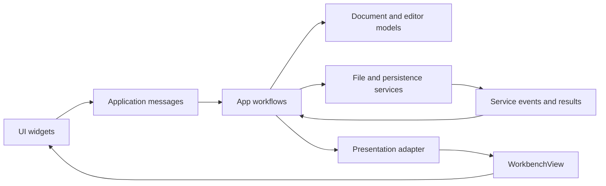

# Architecture and dependency boundaries

Fragile Notepad is one Rust crate. `App` composes the editor, persistence,
windowing, and analysis workflows and connects their results to Iced messages.
UI widgets render borrowed state and emit commands; service implementations
return their own results and events.

## Ownership

| Responsibility | Owner | Contract |
| --- | --- | --- |
| Document data, encoding, dirty state, tabs | `core/` | `Document`, `Workspace`, `DirtyCloseDecision` |
| Editing and navigation intent | `editor/action.rs` | `EditorAction`, `CaretMotion` |
| Physical keyboard interpretation | `editor/widget/actions.rs` | Key events become editor commands |
| Disk I/O | `services/file_system.rs` | Typed file results |
| Native file dialogs | `services/file_dialogs.rs` | Window-aware picker futures |
| Streaming loads | `services/chunked_file.rs` | `Stream<Item = FileLoadEvent>` |
| Service requests and errors | `services/types.rs` | No dependency on application messages |
| Load, save, and close orchestration | `app/files/` | Separate workflows behind the file dispatcher |
| Reveal timing | `app/animation.rs` | State transitions driven by `Instant`, without widgets or messages |
| Unsaved-document confirmation | `app/close_prompt.rs` | Hidden, open, and closing states with a deferred decision |
| Outline requests and cache | `app/outline.rs` | Scheduling, cancellation, and stale-result checks |
| UI projection | `app/presentation.rs` | Iced view/title callbacks and `WorkbenchView` construction |
| Workbench inputs | `ui/view_model.rs` | Named, borrowed render inputs |
| Window titles | `app/windowing/title.rs` | `Title`; required by `ManagedWindow` |

## Dependency rules

- Services do not import `message`, `app`, or `ui`. `Message::from(FileLoadEvent)`
  is the application adapter. `app/files/loading.rs` creates the Iced task and
  owns its cancellation handle.
- File loading uses `futures` streams directly. The four-reader limit, bounded
  channel, load generations, cancellation checks, and incremental decoding remain
  in the loading service. Only the native dialog adapter directly uses Iced's
  window interface in the services layer.
- Editor commands belong to the editor model. Movement logic does not import
  the widget to obtain `CaretMotion`. Keyboard bindings remain an input adapter.
- `ClosePrompt` owns its animation and pending decision together. Callers use
  `show`, `resolve`, `finish`, and `dismiss`; they do not independently change
  the document ID, decision, and animation state. The close workflow performs
  Save/Discard/Cancel after the prompt returns a decision.
- `OutlineParsing` owns cache metadata and abort handles. A workflow removes a
  document through `remove` or resets analysis through `clear`, rather than
  updating a cache map and task map separately. Only current document/revision/
  language/registry results are admitted.
- Presentation converts application state into `WorkbenchView`.
  `ui::workbench::view` receives that named contract instead of a positional
  list of unrelated values.
- Use traits for actual contracts shared by implementations, such as `Title`
  and the existing folding/outline interfaces. Concrete state owners and typed
  events are sufficient where there is only one implementation.

These boundaries apply SOLID through focused responsibilities, narrow contracts,
and dependency direction. They do not require an interface for every struct.
The crate still shares Iced types for settings, input, rendering, and parts of
the document's viewport/syntax model; `core` is not a framework-free library.

## Syntax and function-list parsing

Syntax highlighting, folding, and the function list have separate consumers.
Highlighting uses the editor highlighter; folding uses `folding-hints.xml`.
The function list and function navigation use `editor/outline/`, configured by
`assets/syntax/outline-parsers.xml`.

The outline pipeline is XML schema → compiled registry → source index →
declarations and containers → tree and function entries. The source index owns
one lexical mask, token sequence, and delimiter-pair index per immutable snapshot.
Both scan directions read the same token boundaries. Body matching reuses the
delimiter index, and callable and arrow discovery share statement segmentation.
Lexical shielding consumes complete delimiters and escape sequences while retaining
original UTF-8 byte offsets. Declaration ranges use exclusive ends.

Language keywords, signature modifiers, raw-string formats, word characters,
body delimiters, and end-keyword block rules come from XML. Language adapter names
remain registry metadata; runtime recognition does not dispatch on those names.
Overlapping declaration rules are deduplicated before computing containment, so
nesting represents enclosing declarations rather than historical indentation widths.

`app/outline.rs` retains scheduling, cancellation, and revision/language/registry
checks. The function-list UI consumes the resulting entries without parsing text.
The compiled XML cache is versioned independently of the source schema and is
rebuilt when its version or source hash changes. See
[outline XML configuration](assets/syntax/README.md) for supported rule fields.

## Imports

Types and operations are imported from the module that owns them. Service
results and file dialog adapters live under `services::types` and
`services::file_dialogs`; close decisions live under `core`; editor actions
live under `editor::action`. The application maps service events into
`message::Message`, so the message module does not re-export service contracts.
The streaming load task is constructed with
`Task::run(services::load_file_chunks(request), Message::from)` in the
application. The workbench renderer receives a `ui::view_model::WorkbenchView`
through `ui::workbench::view`.

## Validation

Run `scripts/ci.ps1` on Windows or `scripts/ci.sh` on Unix for the standard checks.
The existing suites cover document edits, wrapping, search, session recovery,
load generations, outline parsing, window behavior, renderer parity, and prompt
fade/decision timing. The refactoring preserves their behavioral assertions;
prompt tests now query its state owner instead of `App`'s former raw fields.
