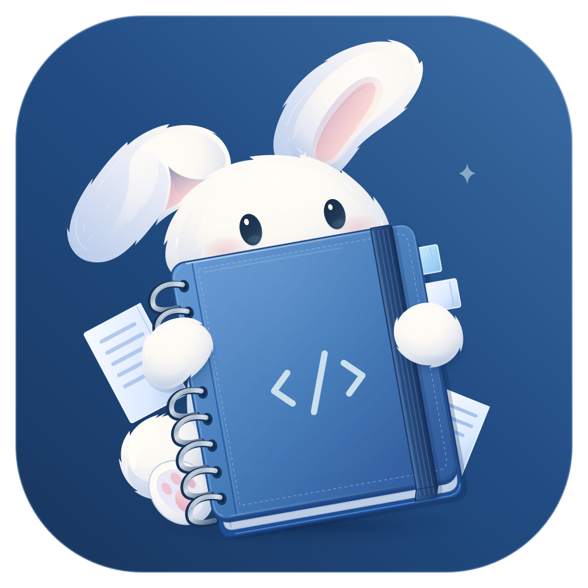

# Fragile Notepad

A desktop text editor for notes and source files. Written in Rust with
[Iced](https://iced.rs), for Windows, Linux, and macOS.

[Releases](https://github.com/MemoriesDoll/fragile-notepad/releases)
&nbsp;·&nbsp; [Development](DEVELOPMENT.md)
&nbsp;·&nbsp; [Architecture](ARCHITECTURE.md)

> **Generative AI Notice:** Generative AI was used throughout the development of this project.

## Build from source

You need Git, a current stable [Rust toolchain](https://rustup.rs), and Python
3.10 or newer. The repository includes its patched dependencies; no separate
vendor checkout step is required. After cloning, install the asset tooling and
use the native build tools for your platform:

```sh
git clone https://github.com/MemoriesDoll/fragile-notepad.git
cd fragile-notepad
python -m pip install -r scripts/requirements-assets.txt
```

Generate the raster assets before every fresh build or after changing an SVG.
The script generates the embedded RGBA files and the Windows ICO / macOS ICNS /
PNG packaging exports; generated files remain ignored by Git.

**Windows — PowerShell**

```powershell
.\scripts\generate_icon_assets.ps1
cargo run --release --locked
```

**Linux / macOS**

```sh
bash scripts/generate_icon_assets.sh
cargo run --release --locked
```

The default build includes the Vulkan renderer and starts with software rendering
before an optional hardware handoff. On macOS, install the Vulkan runtime before
building or running the default feature set:

```bash
brew install molten-vk vulkan-loader vulkan-tools
source scripts/setup-macos-vulkan.sh
```

For a software-only build without Vulkan dependencies, append
`--no-default-features` to both Cargo commands. Linux windowing and Vulkan
packages are listed in the [CI workflow](.github/workflows/ci.yml). See
[Packaging](PACKAGING.md) for release archives and the macOS launcher bundle.

After building, launch `target/release/fragile-notepad.exe` on Windows or
`target/release/fragile-notepad` on Linux/macOS. Windows release builds run
without a console window; debug builds keep the console for diagnostics.

For local checks, run `.\scripts\ci.ps1` on Windows or `bash scripts/ci.sh`
on Linux and macOS.

## License

The project code is licensed under [BSD-3-Clause](LICENSE). Vendored dependencies
retain their upstream licenses; see [vendor provenance](vendor/README.md).
The original artwork in [`assets/icons/colored/`](assets/icons/colored/LICENSE)
and [`assets/illustrations/`](assets/illustrations/LICENSE),
including generated rasters and reproductions, is **all rights reserved** and
excluded from that license. Other bundled icons retain their MIT licenses;
see [Artwork notices](assets/icons/NOTICE.txt).
